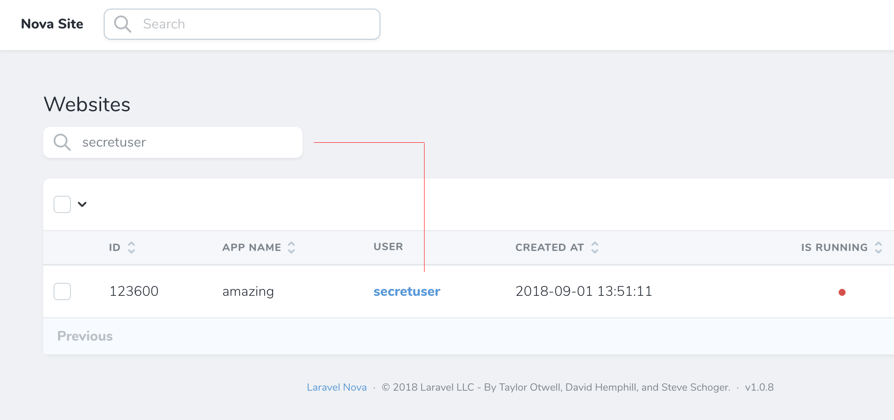

# Search relationships in Laravel Nova

This package allows you to include relationship columns into Laravel Nova search query.

## Screenshot



## Installation

```
composer require titasgailius/search-relations
```

Next, add `Titasgailius\SearchRelations\SearchesRelations` trait to your base resource class `App\Nova\Resource`
```php
use Titasgailius\SearchRelations\SearchesRelations;

abstract class Resource extends NovaResource
{
    use SearchesRelations;
```

## Usage

Simply add `public static $searchRelations` variable to any of your Nova resources.
This array accepts a relationship name as a key and an array of searchable columns as a value.

```php
/**
 * The relationship columns that should be searched.
 *
 * @var array
 */
public static $searchRelations = [
    'user' => ['username', 'email'],
];
```

Alternatively, you may add a static `searchableRelations()` method to return an array of searchable relations.

```php
/**
 * Get the searchable columns for the resource.
 *
 * @return array
 */
public static function searchableRelations(): array
{
    return [
        'user' => ['username', 'email'],
    ];
}
```

## Global search

You may customize the rules of your searchable relationships for global search by defining the `$globalSearchRelations` property.

```php
/**
 * The relationship columns that should be searched globally.
 *
 * @var array
 */
public static $globalSearchRelations = [
    'user' => ['email'],
];
```

Alternatively, you may add a static `globallySearchableRelations()` method to return an array of globally searchable relations.

```php
/**
 * Get the searchable columns for the resource.
 *
 * @return array
 */
public static function globallySearchableRelations(): array
{
    return [
        'user' => ['email'],
    ];
}
```

---
#### Disabling global search for relationships

You may disable the global relationship search by declaring `$globalSearchRelations` with an empty array.

```php
/**
 * The relationship columns that should be searched globally.
 *
 * @var array
 */
public static $globalSearchRelations = [];
```

Alternatevily, you may disable the global search for relationships by setting the `$searchRelationsGlobally` property to `false`.

```php
/**
 * Determine if relations should be searched globally.
 *
 * @var array
 */
public static $searchRelationsGlobally = false;
```

## Nested relationships

You may search nested relationships using dot notation.

```php
/**
 * The relationship columns that should be searched.
 *
 * @var array
 */
public static $searchRelations = [
    'user.country' => ['code'],
];
```

## Extending Search

You may apply custom search logic for the specified relations by retuning a class implementing a `Search` interface.

```php
/**
 * Get the searchable columns for the resource.
 *
 * @return array
 */
public static function searchableRelations(): array
{
    return [
        'country' => new LocationSearch(['USA', 'UK']),
    ];
}
```

Your custom search class must implement a simple `Search` interface that has a single method which accepts
the current query `$query`, a relationship name `$relation` and a search input `$search`.

```php
<?php

namespace Titasgailius\SearchRelations\Contracts;

use Illuminate\Database\Eloquent\Builder;

interface Search
{
    /**
     * Apply search for the given relation.
     *
     * @param  \Illuminate\Database\Eloquent\Builder  $query
     * @param  string  $relation
     * @param  string  $search
     * @return \Illuminate\Database\Eloquent\Builder
     */
    public function apply(Builder $query, string $relation, string $search): Builder;
}
```

You may take a look at the `Titasgailius\SearchRelations\Searches\RelationSearch` class as an example.
